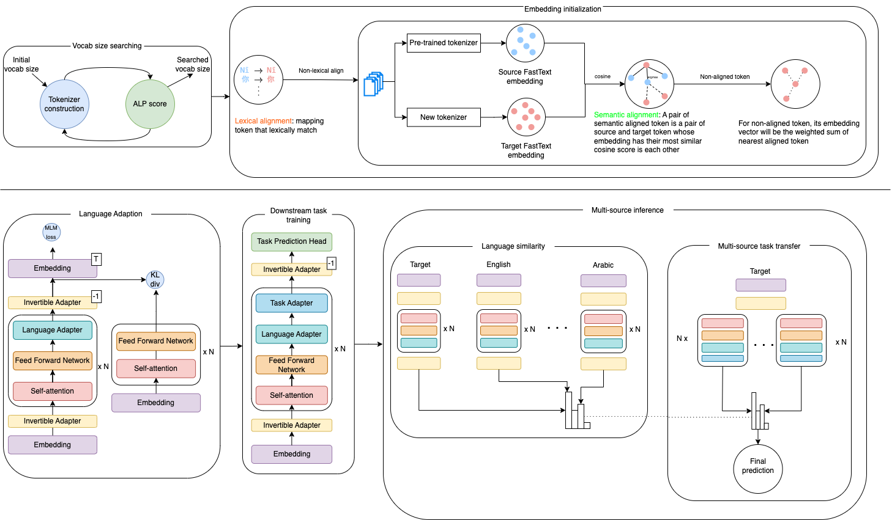

# UniBridge: A Unified Approach to Cross-Lingual Transfer Learning for Low-Resource Languages

> In this paper, we introduce UniBridge (Cross-Lingual Transfer Learning with Optimized Embeddings and Vocabulary), a comprehensive approach developed to improve the effectiveness of Cross-Lingual Transfer Learning, particularly in languages with limited resources. Our approach tackles two essential elements of a language model: the initialization of embeddings and the optimal vocabulary size. Specifically, we propose a novel embedding initialization method that leverages both lexical and semantic alignment for a language. In addition, we present a method for systematically searching for the optimal vocabulary size, ensuring a balance between model complexity and linguistic coverage. Our experiments across multilingual datasets show that our approach greatly improves the F1-Score in several languages. UniBridge is a robust and adaptable solution for cross-lingual systems in various languages, highlighting the significance of initializing embeddings and choosing the right vocabulary size in cross-lingual environments.



Details of the model architecture and experimental results can be found in [our following paper](https://arxiv.org/abs/2406.09717).

Please CITE our paper whenever this repository is used to help produce published results or incorporated into other software.


    @inproceedings{UniBridge,
        title = {{UniBridge: A Unified Approach to Cross-Lingual Transfer Learning for Low-Resource Languages}},
        author = {Pham, Trinh and Le, Khoi M. and Luu, Anh Tuan},
        year = {2024},
        booktitle = {Proceedings of the 62nd Annual Meeting of the Association for Computational Linguistics (Volume 1: Long Papers)},
    }

## Training
1. Building tokenizer.

1.1. Install dependencies

```bash
conda create -n unibridge.tokenizer python=3.9
conda activate unibridge.tokenizer
pip install -r mbert/requirements-main.txt
```

1.2. Building tokenizer

```bash
cd mbert
sh build.sh
cd ../xlm
sh build.sh
```

2. Training

2.1. Install dependencies

```bash
conda create -n unibridge.adapter python=3.9
conda activate unibridge.adapter
pip install -r mbert/requirements-adapter.txt
```

2.2. Training

```bash
cd mbert
sh train.sh
cd ../xlm
sh train.sh
```

## Evaluation

1. Determine harmony weight

```bash
cd mbert
python weight.py
cd ../xlm
python weight.py
```

2. Evaluation

```bash
cd mbert
python pinference_ner.py
python pinference_nli.py
python pinference_pos.py

cd ../xlm
python pinference_ner.py
python pinference_nli.py
python pinference_pos.py
```
